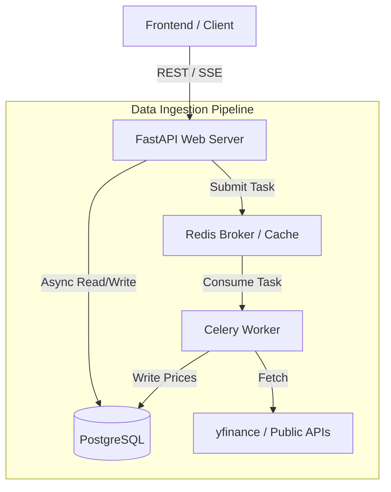

# NiftyFlow

> **Event-driven portfolio analytics and decision support platform.**

NiftyFlow is an intelligent, high-performance financial analytics backend designed to demonstrate production-grade system architecture, fault-tolerant data pipelines, and scalable database design.

## 🚀 Engineering Highlights

- **Asynchronous Architecture:** Built on FastAPI with SQLAlchemy 2.0 and `asyncpg` for fully non-blocking I/O and maximum concurrent request throughput.
- **Fault-Tolerant Ingestion:** Implements Celery and Redis to decouple external market data fetching from the API event loop, protecting against external rate limits and API failures.
- **Data Integrity:** Utilizes Alembic for version-controlled database schema migrations.
- **Multi-Tenant Security:** Secure JWT-based authentication with strict object-level authorization (RLS logic) to isolate user portfolios.

## 🛠️ Tech Stack

- **Backend:** Python 3.9+, FastAPI
- **Database:** PostgreSQL, SQLAlchemy 2.0 (async), Alembic
- **Task Queue:** Celery, Redis
- **Market Data:** `yfinance` (Free tier, intelligently rate-limited via Celery workers)
- **Security:** OAuth2, JWT, Passlib (bcrypt)
- **Deployment:** Docker, Docker Compose

## 🏗️ Architecture

## 🏃‍♂️ Local Development

*Setup instructions coming soon.*

## 📈 Roadmap

- [ ] **Phase 0:** Project scaffolding, Async SQLAlchemy, and Alembic setup
- [ ] **Phase 1:** JWT Authentication and multi-tenant schema
- [ ] **Phase 2:** Celery & Redis background workers for data ingestion
- [ ] **Phase 3:** Automated testing suite (Pytest)
- [ ] **Phase 4:** ML-based decision support system (Offline inference)
- [ ] **Phase 5:** Next.js Dashboard

---
*Built as a flagship engineering demonstration project.*

## Background Workers

The project uses Celery and Redis to handle asynchronous and scheduled background tasks.

### Running the Celery Worker

To process queued tasks:
``bash
celery -A backend.worker.celery_app worker --loglevel=INFO --pool=solo
``
*(Note: On Windows, use --pool=solo for stable execution).*

### Running the Celery Beat Scheduler

To trigger scheduled tasks (e.g., nightly updates):
``bash
celery -A backend.worker.celery_app beat --loglevel=INFO
``

### Background Task Configuration

Scheduling and rate-limiting are controlled via .env:
- STOCK_FULL_UPDATE_TIME=21:00 (Default time for nightly update)
- STOCK_FULL_UPDATE_TIMEZONE=UTC (Default timezone. 21:00 UTC = 02:30 IST)
- STOCK_ACTIVE_UPDATE_INTERVAL_MINUTES=15 (Interval for active portfolio stock updates)
- YFINANCE_BATCH_SIZE=50 (Throttle setting)
- YFINANCE_REQUEST_DELAY_SECONDS=1.0 (Throttle setting)

